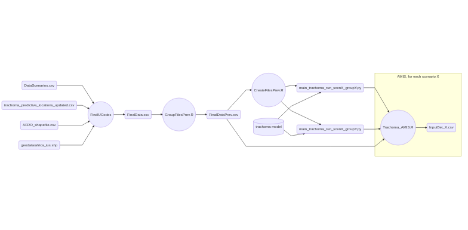

# 1 - Generating IUCodes from geoconnect IDs

Original data provided by ????, location are identified by geoconnect ID
```
# data_cleaning/AFRO_shapefile.csv

ADMIN0ID,ADMIN1,ADMIN1ID,ADMIN2,ADMIN2ID,ADMIN3,ADMIN3ID,ADMIN0,geoconnect,Shape_Leng,Shape_Area,long,lat
24.000000000000000,Amhara,609.000000000000000,N. Shoa,26086.000000000000000,Baso Naworana,660.000000000000000,Ethiopia,6303.000000000000000,0.495734156180000,0.006293784810000,39.378936736202200,9.710504722218760
24.000000000000000,Amhara,609.000000000000000,West Gojam,3193.000000000000000,Gongi Kolela,289.000000000000000,Ethiopia,6217.000000000000000,0.665967526200000,0.018789127440000,37.675122928922600,11.319006794396100
...
```

*Goal*: The goal is to give location the correct IU code based on the geoconnect ID.

This is done by `data_cleaning/FindIUCode.R`. This script relies on the following data files

- `DataScenarios.csv`: Describe surveys and scenario per location. Locations are identified by Geoconnect ID
- `trachoma_predictive_locations_updated.csv`: The list of locations at which we want to predict trachoma prevalence
- `AFRO_shapefile.csv`: **???**. Locations are described by Geoconnect ID.
- `IUCodeTrachomaGroups.csv`: Maps geoconnect ids to IU code for some locations. **group no is already there?**.
- `geodata/africa_ius.shp`: **???**

Purpose of file `PredictionsIUCodesFinal.csv` is unclear. Intermediate manual step?

```R
CodesFinal = Codes

#write.csv(data.frame(Predictions, Codes), file = "PredictionsIUcodes.csv", row.names = F)

DataFinal = read.csv("PredictionsIUcodesFinal.csv")
```

The output of this step is the file `FinalData.csv`, with both the Geoconnect ID and the IU Code.

```
# data_cleaning/FinalData.csv
"Country","Region","District","Subdistrict","Geoconnect_ID","Pop_point","Pop_district","Logit","Sds","IUCodes","start_MDA","last_MDA","Scenario"
"Ethiopia","Amhara","N. Shoa","Baso Naworana",6303,161.3058472,13128.23101,-1.814302776,0.243590266,"ETH18551",2008,2017,36
"Ethiopia","Amhara","West Gojam","Gongi Kolela",6217,288.9628601,69764.48892,-1.28066311,0.255922043,"ETH18604",2008,2019,28
...
```

# 2 - Sample an ensemble of parameter sets using AMIS

**What are the model parameters?**

We want to find the right transmission model parameters at each
location (Implementation Unit).  We start from geostatistical data
that represents the observed distribution of prevalences at IUs. We use
the AMIS algorithm to sample a set of 200 parameters from a
distribution that best matches the observed distribution of
parameters.

With these parameters and the associated statistical weight, we can
then run 200 simulations and predict prevalence statistics at each
location.


## 2.1 - Group scenarios according to mean prevalence

Each IU is associated with one Mass Drug Administration (MDA) event, that may span several years.
Each MDA, does not occur at the same dates for all IUs, and each location is therefore associated with
a scenario which represents the MDA start date and end date for this specific location.

For instance, the locality of Baso Naworana in Ethiopia is associated to scenario 36, meaning that
the MDA started in year 2008 and ended in year 2017.
```
# data_cleaning/FinalData.csv
"Country","Region","District","Subdistrict",...,"IUCodes","start_MDA","last_MDA","Scenario"
"Ethiopia","Amhara","N. Shoa","Baso Naworana",...,"ETH18551",2008,2017,36
```

Implementation units are grouped according the observed mean prevalence **in year 2019 (??)**.
This value depends on the local transmission parameters but also the local MDA scenario.

*TODO describe computaion of mean prevalence here*

In the current implementation, a prevalence group spans a range of 10% prevalence, meaning that IUs with a observed 2019 mean prevalence between 0% and 10% fall in group 1, IUs between 10% and 20% fall in group 2, and so on. Specially, all IUs leading to a mean prevalence above 60% are combined into a single group and will not be considered
in the AMIS algorithm later on.

The output of this steps is a new data file `find_200_values/FinalDataPrev.csv` with an additional column indicating the prevalence group:

```
# find_200_values/FinalDataPrev.csv

"Country","Region","District","Subdistrict",...,"IUCodes","start_MDA","last_MDA","Scenario","Group"
"Ethiopia","Amhara","N. Shoa","Baso Naworana",...,"ETH18551",2008,2017,36,2
"Ethiopia","Amhara","West Gojam","Gongi Kolela",...,"ETH18604",2008,2019,28,3
```

## 2.2 - Prepare python codes to run the transmission model within the AMIS algorithm

The AMIS algorithm is run for each different value of the pair `(scenario,group)`.

For each row of a dataframe `ScenarioGroupPair` defined as

```R
> Data = read.csv("FinalDataPrev.csv")
> ScenarioGroupPair = unique(data.frame(Data$Scenario, Data$Group))
> ScenarioGroupPair[1:5,]
  Data.Scenario Data.Group
1            36          2
2            28          3
3            45          3
4            28          2
5            46          2
```

a distribution of parameters is estimated for each IU that correspond
to the scenario and group. Following the abocve example, a first AMIS
run would estimate the distribution of parameters for all IUs in group
2 with scenario 26. Another AMIS run would estimate the parameters for
all IUs in group 3 with scenario 28.

Following the AMIS algorithm, the distribution of parameters at a IU is estimated
iteratively, starting from an initial proposal distribution. At each new iteration,
$N=100$ parameter sets are sampled from the previously estimated distribution. They are then used as an input for N simulations of the transmission model which computes the
corresponding 2019 prevalence value. From this sample of $N$ prevalence values, a new proposal distribution is estimated for transmission parameters. The procedure is iterated until a suitable estimate is computed. *TODO - Add ref to ESS criterion*

The trachoma transmission model is implemented in Python (`find_200_values/trachoma`) and is run from the AMIS R script using the `reticulate` package.

The Python trachoma model package makes available a function `Trachoma_simulation`
that simulates the transmission model for a given set of parameters and a given scenartio and outputs prevalence and infection data over the course of the simulation.
This function is not called direcrly from the AMIS R script but instead by running a python script `main_trachoma_scenX_groupY.py` which calls a `test()` function wrapping the
`Trachoma_Simulation` function call. Function `test` is defined is a Python file
`main_trachoma_run_scenX_groupY.py` which is sourced (using `reticulate`'s `source_python`)
ahead of the simulations:

```python
# find_200_values/main_trachoma_run_scen36_group2.py

from trachoma.trachoma_simulations import Trachoma_Simulation

def test():
	 Trachoma_Simulation(BetFilePath='files/InputBet_scen36_group2.csv',
	 	 	 	 MDAFilePath='files/InputMDA_scen36.csv',
	 	 	 	 PrevFilePath='output/OutputPrev_scen36_group2.csv',
	 	 	 	 InfectFilePath='output/InfectFilePath_scen36_group2.csv',
	 	 	 	 SaveOutput=False,
	 	 	 	 OutSimFilePath=None,
	 	 	 	 InSimFilePath=None)
```

Files `main_trachoma_scenX_groupY.py` and `main_trachoma_run_scenX_groupY.py` are written
before hand, for each `(scenario,group)` pair. This is done by R script `CreateFilesPrev.R`:

```R
# find_200_values/CreateFilesPrev.R

# ....
  
filename = paste("main_trachoma_scen", Scen[i], "_group", Group[i], ".py", sep="")
cat(file=filename, paste("test()"), append = F)
  
filename = paste("main_trachoma_run_scen", Scen[i], "_group", Group[i], ".py", sep="")
FilePrev(filename, i)
```

In addition, the scenario parameters are written in a file
`files/InputMDA_scenX.csv` for each scenario.  This file is one of the
two input files required by `Trachoma_simulation`, along with
`InputBet_scenX_groupY.csv` which lists the values for the different
sets of parameters (computed at each iteration of the AMIS algorithm).

## 2.3 - Run the AMIS algorithm in parallel for each scenario

### Job submission

Not sure which script?

```shell
#!/bin/bash 
#SBATCH --nodes=1
#SBATCH --ntasks-per-node=2
#SBATCH --time=48:00:00
#SBATCH --partition=ntd
#SBATCH -a 1-264
#SBATCH --mem-per-cpu=3882

module load gnu7/7.3.0
module load R

time R --vanilla < Trachoma_AMIS_perprev.r > Quick_basic
```

Size of Slurm array is number of `(scenario,group)` combinations?

### First iteration

We start with a set of $N$ parameters sampled from an initial guess and compute the
prevalence corresponding to each of them, running the transimission model for the scenario.

```R
t<-1  # First iteration
tmp<-rprop0(N[t])    #N[t] random draws of parameters from prior
x <- tmp[[1]]  # bet
y <- tmp[[2]]  # constant
seed <- c(1:N[t])
allseed <- seed
input_params <- cbind(seed, x)
colnames(input_params) = c("randomgen", "bet")
write.csv(input_params, file=inputbeta, row.names=FALSE)

### Run Python
source_python(run_py_file)
```

The transimission model writes a file `output/OutputPrev_scenX_groupY.csv` (`prevalence_output`) that contains the computed prevalences for each parameter set.
This file is read and each parameter set is weighted according to the observed prevalence values (`prev`)

```R
# read in python output file
res <- read.csv(prevalence_output)
ans <- 100*res[,dim(res)[2]]

#weights over all IUs
w<-sapply(1:length(ans), function(i) length(which((prev>ans[i]-delta/2) &(prev<=ans[i]+delta/2)))/length(which((ans>ans[i]-delta/2) & (ans<=ans[i]+delta/2))))
```

Based on these weights, and effective sample size is computed that is used to determine whether or not the algorithm has converged for a given IU.

### Second and follwing iterations

At each subsequent iteration, a new proposal distribution is sampled building on the proposal distribution sampled at the previous step.

The algorithm stops when each IU as reached the effective sample size.

The output of the AMIS is a set of $N$ parameter sets and their associated weight for each IU. This is stored into a dataframe `sparamWW` which is written to disk
as `sparamWW.csv.`

### Sampling 200 parameter sets

For each IU, the AMIS algorithm yields a set of `N*T` weighted parameter sets.  For each IU, `n=200` parameter sets are sampled from the weighted ensemble.
These parameter values are written in `files200/InputBet_X.csv` where `X` is the scenario index.

```R
for(i in 1:n.pixels) {
  set.seed(i)
  simul = sample.int(length(sparamWW[, 3]), 200, replace = F, prob = sparamWW[, i+4])
  InitValues = cbind(sparamWW[simul, 1], sparamWW[simul, 2])
  colnames(InitValues) = c("randomgen", "bet")
  write.csv(InitValues, file = paste("files200/InputBet_", IU_scen_name[i], ".csv", sep=""), row.names = F)
  file.copy(from=sprintf("files/InputMDA_scen%g.csv", Scen[iscen]), to = paste("files200/InputMDA_", IU_scen_name[i], ".csv", sep=""))
}
```

# 3 - Running the transmission model for the 200 parameter sets

To be able to restart from the beginning of 2020, we must store the state of the system (e.g. infected part of the population) at this date.
With the model parameter for all IUs sampled using the AMIS algorithm, we (re)simulate the dynamics for all IUs, starting from a common date
before the start of the first MDA event (is this date **1998?**).

```python
# run_200/trachoma_run_200.py
import sys

# ...

from trachoma.trachoma_simulations import Trachoma_Simulation

Trachoma_Simulation(BetFilePath=BetFilePath,
                    MDAFilePath=MDAFilePath,
                    PrevFilePath=PrevFilePath,
                    InfectFilePath=InfectFilePath,
                    SaveOutput=True,
                    OutSimFilePath=OutSimFilePath,
                    InSimFilePath=None)
```

Currently, there are two approaches to perform this step.

1. Run the resimulation directly following the AMIS algorithm after sampling the model parameter.
2. Write the sampled parameters in a file for all IUs (one file per IU) following the AMIS and launch
   the resimulation in separate jobs for all IUs.
   
   ```R
   IUCodes = DataScenarios$Data.IUCodes

	for (i in 1:length(IUCodes))
	{
		filename = paste("IU", IUCodes[i], sep="_")
		cat(file=filename, "#!/bin/bash",  "\n", append = F)
		cat(file=filename, "#SBATCH --nodes=1" ,  "\n", append = T)
		cat(file=filename, "#SBATCH --ntasks-per-node=4" ,  "\n", append = T)
		cat(file=filename, "#SBATCH --time=11:59:00" ,  "\n", append = T)
		# ...
		name = paste("sbatch ", paste("IU", IUCodes[i], sep="_"))
		cat(file="Send.txt", name,  "\n", append = T)
	}
   ```
   
   
